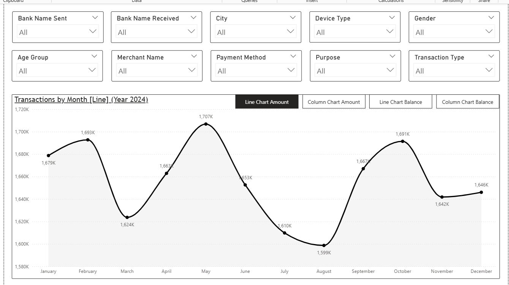
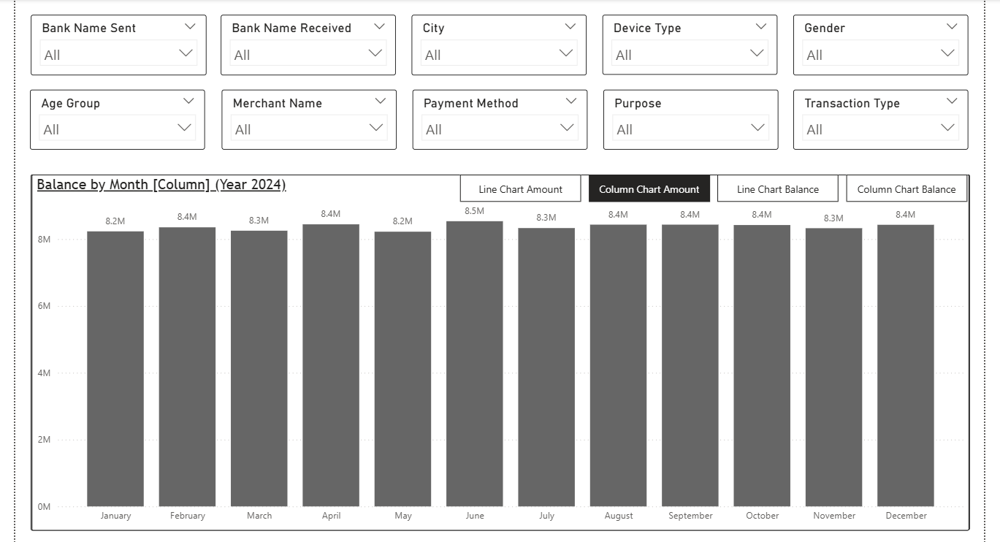
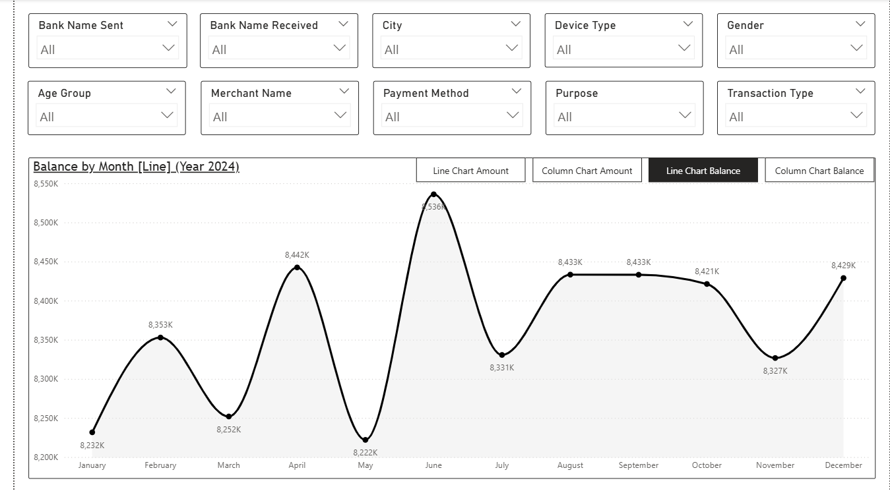
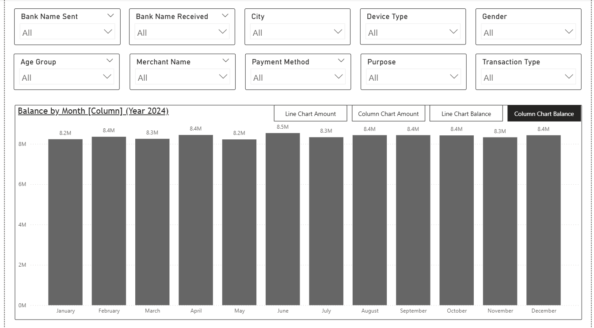

# 📊 Power BI Project – UPI Transactions Analysis

An interactive **Power BI dashboard** built to analyze UPI transactions, usage patterns, and customer behavior.  
The project highlights advanced Power BI features like **cross-page filtering, multiple slicers, and bookmarks** for a professional BI experience.

---

## 🔗 Table of Contents
- [📘 Project Overview](#-project-overview)
- [📁 Folder Structure](#-folder-structure)
- [📦 Dataset Description](#-dataset-description)
- [📊 Dashboard Features](#-dashboard-features)
- [📸 Dashboard Images](#-dashboard-images)
- [🛠️ Tools Used](#️-tools-used)
- [✍️ Author](#-author)

---

## 📘 Project Overview
The **UPI Transactions Analysis Dashboard** provides a detailed view of transactions and trends across different dimensions.  
With interactive filters, connected slicers, and bookmarks, users can explore UPI usage at a granular level.

---

## 📁 Folder Structure

upi-transactions-analysis/
│
├── 01_Data/
│ └── UPI Transactions.xlsx
│
├── 02_PowerBI_Dashboard/
│ └── UPI Transactions Analysis.pbix
│
├── 03_Images/
│ ├── 1.png
│ ├── 2.png
│ ├── 3.png
│ └── 4.png
│
└── README.md

---

## 📦 Dataset Description
The dataset (**UPI Transactions.xlsx**) contains information such as:
- **Transaction ID**  
- **Date & Time**  
- **UPI App / Bank**  
- **Transaction Amount**  
- **Customer Demographics (Age, Gender, Region)**  
- **Status (Success / Failure)**  

---

## 📊 Dashboard Features
📂 [View PBIX File](./02_PowerBI_Dashboard/UPI%20Transactions%20Analysis.pbix)

- **2 dashboard pages** with insights on transactions & user patterns  
- **10 slicers** for filtering data across both pages (cross-page filtering enabled)  
- **4 bookmarks** to quickly switch between key views  
- Transaction trends by time, region, and amount  
- Success vs. failure rate analysis  
- Customer demographic insights  

---

## 📸 Dashboard Images
  
  
  
  

---

## 🛠️ Tools Used
- **Power BI** – Data visualization & dashboard creation  
- **Excel/CSV** – Raw data storage  
- **DAX** – Calculated measures for KPIs  
- **Power Query** – Data cleaning & transformation  

---

## ✍️ Author
**Gulbaaz**  
DTU’22 | Aspiring Data & Business Analyst | SQL, Excel, Power BI Projects on GitHub  
📫 [GitHub Profile](https://github.com/Gulbaaz)

